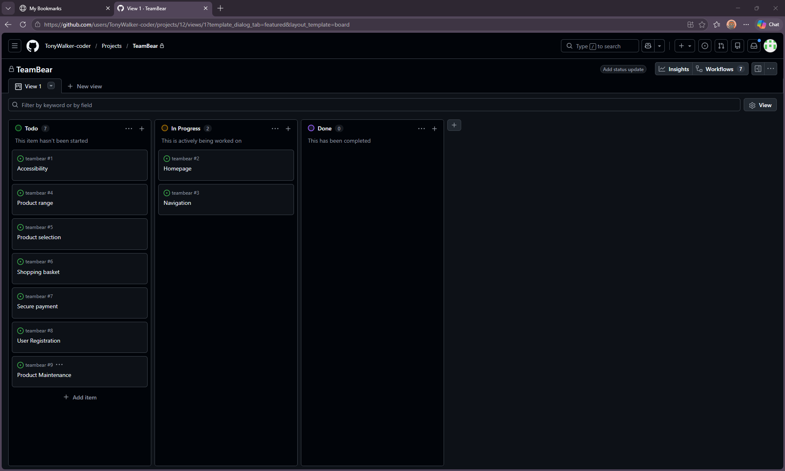
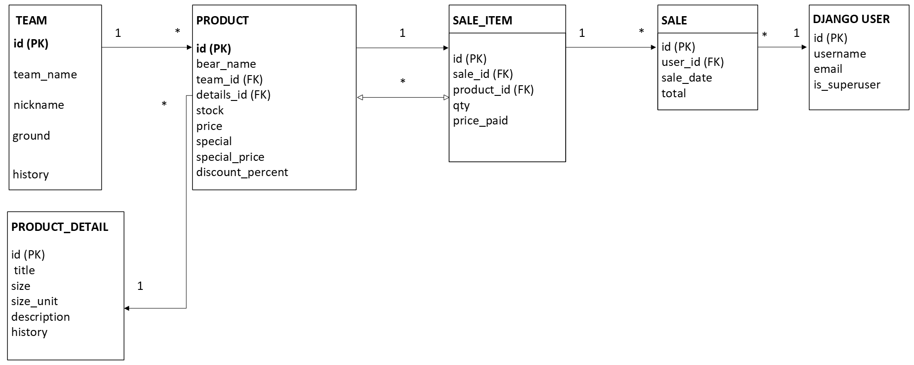

# TeamBear

## Table of Contents

- [User Stories](#userstory)
- [Intellectual Property & Educational Use](#ip)
- [Image store and handling](#imagestore)
- [Acknowledgements](#acknowledgements)
- [Deployment](#deployment)
- [Colour Palette Strategy](#colours)
- [Typography](#typography)
- [Comments and symbols](#symbols)
- [Technology Stack](#stack)
- [Project Management](#git)
- [Entity Relationship Diagram (ERD)](#erd)
- [Wire frame layout](#wire)
- [Custom Error Pages](#404pages)
- [Team Data](#data)

## User Stories
 
### Introduction
 
The purpose of TeamBear is to provide an e-commerce platform for selling bespoke teddy bears. The application is designed to allow customers to easily browse products, view detailed information, and complete purchases through a secure and intuitive interface.
 
By focusing on usability, accessibility, and customer satisfaction, the site aims to encourage repeat purchase.

## Accessibility (*must have*)
 
### User Story
 
As a site owner, I want the website to be accessible and responsive so that all users can navigate and interact with the site regardless of device, browser, or assistive technology.
 
### Acceptance Criteria
 
#### Accessibility
 
- All form inputs must have associated `<label>` elements.
- All interactive elements must be fully keyboard accessible.
- Screen readers must be able to identify the purpose of all controls and content.
- Colour contrast must meet WCAG AA accessibility standards.
- Appropriate semantic HTML must be used throughout the site.
- ARIA attributes must be used where required to improve accessibility.
 
#### Responsiveness
 
- The site must be fully responsive across desktop, tablet, and mobile devices.
- Users should be able to access the same functionality regardless of platform.
- Navigation and layout should remain intuitive across all screen sizes.
 
#### Consistency
 
- Styling must remain consistent across all pages.
- The homepage should establish the visual theme used throughout the site.
- The navigation bar should remain visible and easily accessible throughout the user journey.
 
### Tasks
 
- [ ] Create a colour changing theme system.
- [ ] Define design tokens in `*.css`.
- [ ] Create a fixed header/navigation bar.
- [ ] Ensure full keyboard navigation.
- [ ] Test compatibility with screen readers etc with lighthouse.
- [ ] Implement ARIA labels where appropriate.
- [ ] Validate colour contrast against WCAG AA standards.
- [ ] Test responsiveness across desktop, tablet, and mobile devices.

## Homepage (*must have*)
 
### User Story
 
As a site owner, I want the homepage to present the TeamBear brand in a clear and professional manner so that visitors immediately understand the products we sell and feel encouraged to explore the website.
 
### Acceptance Criteria
 
- The site must have a dedicated homepage that serves as the main entry point for visitors.
- The homepage must clearly communicate the purpose of the site and the products available.
- A prominent hero section must showcase the TeamBear brand and product range.
- The visual theme established on the homepage must remain consistent throughout the site.
- The homepage must provide clear navigation to key areas of the website.
- The layout must remain visually appealing and functional on desktop, tablet, and mobile devices.
 
### Tasks
 
- [ ] Create a homepage template.
- [ ] Include a themed hero image or banner logo.
- [ ] Add a clear heading.
- [ ] Create call-to-action buttons linking to products.
- [ ] Ensure the hero image scales appropriately across screen sizes.
- [ ] Maintain branding and styling consistency throughout the site.
- [ ] Test responsiveness on desktop, tablet, and mobile devices.

## Navigation (*must have*)
 
### User Story
 
As a visitor, I want to navigate the site intuitively and efficiently so that I can quickly access the information and features I need.
 
### Acceptance Criteria
 
- A navigation bar is displayed on every page of the website.
- The navigation bar remains consistent in appearance and functionality across all pages.
- Navigation links allow users to move easily between key sections of the site.
- The navigation menu is fully responsive and accessible on smaller screen sizes.
 
### Tasks
 
- [ ]  Create a reusable navbar template.
- [ ]  Implement a responsive mobile navigation menu.
- [ ]  Attach the navbar to a fixed header for persistent access during scrolling.
- [ ]  Ensure navigation links are consistent across all pages.
- [ ]  Test navbar functionality on desktop, tablet, and mobile devices.

## Product range (*must have*)
 
### User Story
 
As a visitor, I want to search and browse the product range so that I can quickly find products that match my interests and view my selected results in one place.
 
### Acceptance Criteria
 
- Products can be filtered and searched using multiple categories.
- Search results are displayed in a responsive grid layout.
- Each product is presented within a consistent product card.
- Product cards display all relevant product information, including name, image, category, and description.
- A fallback image is displayed when a product image is unavailable.
 
### Tasks
 
- [ ]  Create product search and filtering functionality.
- [ ]  Implement category-based filtering options.
- [ ]  Design and build a reusable product card component.
- [ ]  Display all relevant product information within each card.
- [ ]  Create and implement a standard fallback image.
- [ ]  Develop a responsive grid layout for product display.
- [ ]  Test search and filtering functionality across different devices.

## Product selection (*must have*)
 
### User Story
 
As a visitor, I want to select products I wish to purchase so that I can add them to my shopping basket and manage the quantity before checkout.
 
### Acceptance Criteria
 
- Product cards are clickable and allow users to view or select a product.
- Users can choose the quantity of a selected product.
- Selected products are added to the shopping basket.
- The shopping basket updates automatically when products are added.
- Users receive clear visual feedback confirming that a product has been added to the basket.
 
### Tasks
 
- [ ] Make product cards clickable.
- [ ] Create a product detail or selection view.
- [ ] Implement a quantity selector.
- [ ] Add functionality to add products to the shopping basket.
- [ ] Display a confirmation message when a product is added.
- [ ] Update basket totals and item counts dynamically.
- [ ] Test product selection and basket functionality across different devices.

## Shopping basket (*must have*)
 
### User Story
 
As a visitor, I want to view the products I have selected, along with their quantities and total cost, so that I can review my order before proceeding to checkout.
 
### Acceptance Criteria
 
- The shopping basket displays all selected products.
- Each basket item shows the product name, quantity, and individual price.
- The subtotal for each product is calculated based on the item price multiplied by the selected quantity.
- The basket displays the overall total cost of all selected products.
- Basket contents update automatically when products are added, removed, or quantities are changed.
 
### Tasks
 
- [ ] Create a shopping basket view.
- [ ] Display selected products within the basket.
- [ ] Track and display individual product prices.
- [ ] Calculate and display item subtotals.
- [ ] Calculate and display the basket total.
- [ ] Implement functionality to update item quantities.
- [ ] Implement functionality to remove products from the basket.
- [ ] Test basket calculations and updates across different devices.

## Secure payment (*must have*)
 
### User Story
 
As a visitor, I want my payment information to be handled securely so that I can complete my purchase with confidence.
 
### Acceptance Criteria
 
- A dedicated checkout page is provided for processing orders.
- The checkout form collects all information required to complete a purchase.
- Payments are processed through a secure third-party payment provider.
- Sensitive payment information is not stored within the application.
- Users receive clear confirmation when a payment is successful.
- Users are informed if a payment fails and are given the opportunity to try again.
- Customers can choose to receive an order confirmation email.
 
### Tasks
 
- [ ] Create a dedicated checkout page.
- [ ] Integrate Stripe as the payment processor.
- [ ] Validate customer and payment information before submission.
- [ ] Secure all API keys and sensitive configuration variables using environment variables.
- [ ] Implement payment success and failure handling.
- [ ] Display transaction status messages to users.
- [ ] Generate and store order records following successful payments.
- [ ] Send an order confirmation email when requested.
- [ ] Test payment workflows using Stripe test payments.

## User Registration (*must have*)

### User Story

As a visitor, I want to create an account so that I can access my order history, receive member benefits, and enjoy a more personalised shopping experience.

### Acceptance Criteria

- Visitors can register for an account using a valid email address and password.
- Registered users can securely log in and log out.
- Registered users can view their previous orders.
- Registered users can access any available member discounts or special offers.
- Users receive confirmation when registration is successful.
- User account information is stored securely.

### Tasks

- [ ] Create a user registration form.
- [ ] Create a login and logout system.
- [ ] Validate registration data and password requirements.
- [ ] Store user information securely.
- [ ] Create an account dashboard page.
- [ ] Display previous orders on the user dashboard.
- [ ] Implement member discount functionality.
- [ ] Display registration and authentication messages.
- [ ] Test registration, login, and account management features.

## Product Maintenance (*should have*)

### User Story

As a site owner, I want additional product management options to be available when I am logged in so that I can quickly update products without leaving the main site interface.

### Acceptance Criteria

- Product management controls are only visible to authorised site owners.
- Regular users cannot see or access management controls.
- Site owners can update product prices.
- Site owners can update stock levels.
- Site owners can mark products as special offers.
- Changes are saved and reflected immediately on the site.

### Tasks

- [ ] Restrict management features to authorised users.
- [ ] Display edit controls conditionally based on user permissions.
- [ ] Implement price editing functionality.
- [ ] Implement stock level editing functionality.
- [ ] Implement a special offer toggle.
- [ ] Display confirmation messages when changes are saved.
- [ ] Test role-based access and permissions.

## Intellectual Property & Educational Use

This project was created solely for educational and portfolio purposes as part of a software development programme.
 
Football-related imagery, colours, and designs have been used to demonstrate the functionality of the application. Any club names, crests, kit designs, sponsor references, or other trademarks remain the property of their respective owners.
 
This project is not affiliated with, endorsed by, sponsored by, or associated with any football club, league, manufacturer, or sponsor.
 
The website is non-commercial and has been developed exclusively for educational assessment purposes.

## Site Footer Disclaimer

Educational Project Disclaimer
 
TeamBear. This website is provided for educational and demonstration purposes.

This website is an educational and demonstration project. Any trademarks, product names or third-party content remain the property of their respective owners.

### Image store and handling

A source image store was maintained during development containing original PNG assets. Optimised WebP versions were generated from these originals for deployment. This allowed assets to be modified and regenerated throughout testing without cumulative quality loss. Once testing was complete and the final optimised images were produced, the original working assets were removed from the deployed project.

## Acknowledgements

- Adobe Firefly
    - used to create the product images
    - https://firefly.adobe.com/
- icons8
    - https://icons8.com/icons
    - Source for icon and svg used on the site

- Fonts
    - Englebert font provided by Google Fonts
    - Henny Penny font provided by Google Fonts

- Microsoft Co-Pilot
    - Used to gather real team data for the team model

## Deployment

### Local Deployment

Clone the repository:

git clone https://github.com/TonyWalker-coder/teambear

Change into the project directory:

git checkout main

cd teambear

Create a virtual environment:

python -m venv .venv

Activate the virtual environment:

.venv\Scripts\activate

Install dependencies:

pip install -r requirements.txt

This project uses a `.env` file for environment variables. Update the values to match your local configuration.

Apply database migrations:

python manage.py migrate

Run the development server:

python manage.py runserver

Create a new application via your hosting provider dashboard.

Configure all required environment variables, including:

- SECRET_KEY
- DATABASE_URL
- DEBUG
- ALLOWED_HOSTS

Install project dependencies:

pip install -r requirements.txt

Apply database migrations:

python manage.py migrate

Ensure:

DEBUG=False

Start the application using the hosting provider's deployment settings.

### Media Files

This project uses Django ImageField and therefore requires the Pillow package.

Pillow is included in requirements.txt and will be installed automatically during deployment.

## Colour Palette Strategy 🎨

Rather than implementing a traditional light and dark mode, TeamBear uses a palette-based theme system. This approach allows users to choose from a selection of carefully designed colour palettes while maintaining consistent branding, accessibility, and contrast standards across the application.

Each palette is built from a shared set of semantic colour variables, allowing the visual appearance of the site to change without requiring modifications to individual components. This ensures a consistent user experience while providing greater visual flexibility and personalisation.

The palette system offers several benefits:

- Enhanced user customisation through multiple theme choices.
- Consistent styling across all pages and components.
- Simplified maintenance through centralised theme variables.
- Improved accessibility through controlled contrast testing for each palette.
- A scalable foundation for adding additional themes in future releases.

The theme switcher updates the site's colour variables dynamically, enabling users to select a preferred visual style while preserving the overall layout, functionality, and accessibility of the application.

### Example Palettes

Classic Bear
Primary:   #8B4513
Secondary: #D2B48C
Accent:    #FFD700

Forest
Primary:   #2F5D50
Secondary: #8DB596
Accent:    #F4D35E

Football
Primary:   #1E3A5F
Secondary: #FFFFFF
Accent:    #E63946

Heritage
Primary:   #5B4636
Secondary: #E8D8C3
Accent:    #C08A3E

## Typography

TeamBear uses a combination of widely supported web-safe fonts to provide a consistent experience across browsers and devices without relying on external font services.

### Headings

`font-family: Georgia, serif;`

Georgia is used for headings and key content areas. Its traditional serif design helps reinforce the heritage and collectible nature of the TeamBear brand while providing clear visual hierarchy throughout the site.

### Body Text

`font-family: Tahoma, sans-serif;`

Tahoma is used for primary content and interface elements. Its clean sans-serif design offers excellent readability at a variety of screen sizes and supports a clear user experience across desktop, tablet, and mobile devices.

### Font Strategy

The typography strategy was chosen to:

- Provide strong readability across devices.
- Create a clear distinction between headings and body content.
- Avoid external font dependencies.
- Improve performance by using fonts commonly available on modern operating systems.
- Maintain a professional and accessible presentation throughout the application.

## Comments and symbols

All best efforts are made to try and follow a unified commenting practice throughout the documentation, in order to try a facilitate this here are some best practice examples used.

⚠️ comment

- these are temporary comments or coded sections that need to be removed before submission
- example
    - `<!-- ⚠️ temporary version number to force mobile fetch and refresh`
    - `<link rel="stylesheet" href="">-->`

    - `<link rel="stylesheet" href="?v=2">`

## Technology Stack
 
### Backend
- Python 3
- Django 6.1.1
- Gunicorn
 
### Database
- SQLite (Development)
- PostgreSQL (Production)
 
### Frontend
- HTML5
- CSS3
- JavaScript (Vanilla JS)
 
### Media & Static Files
- Pillow
- WhiteNoise
 
### Configuration & Deployment
- python-dotenv
- dj-database-url
 
### Code Quality
- Ruff
- ESLite

### Design & Assets
- Google Fonts
- Englebert
- Henny Penny
- SVG Graphics
- WebP Images
 
### Design & Planning
- Balsamiq Wireframes
- Microsoft Powerpoint (ERD)
- Git & GitHub
- GitHub Projects
 
### Potential Future Technologies
- Django Authentication
- Django Allauth (under evaluation)
- Stripe (under evaluation)

## Project Management

The site uses Git Hub project management to manage the project workflow

## Entity Relationship Diagram (ERD)
 
The TeamBear database was designed to support:
 
- Teams and team information
- Product inventory
- Product details and descriptions
- Customer sales
- Django user accounts
 
The completed ERD is shown below and was used to guide model creation and database relationships throughout the project.

## Wire frame layout

The project will be using CSS responsive grid for product cards and responsive screen layouts for other screens

## Custom Error Pages

TeamBear includes customised error pages to provide a consistent user experience when unexpected situations occur.

Instead of displaying Django's default error responses, branded TeamBear pages have been created for common HTTP errors including:

- 404 (Page Not Found)
- 403 (Access Denied)
- 500 (Internal Server Error)

Each page uses themed TeamBear artwork, consistent navigation, and user-friendly messaging designed to help visitors understand what has happened and how to continue using the website. This approach maintains visual consistency across the site and improves the overall user experience when errors occur.

## Team Data

An initial team dataset was generated with assistance from Microsoft Copilot and manually reviewed before import into the TeamBear database.

The dataset is intended to provide realistic club names, nicknames, grounds and short historical descriptions for demonstration, testing and educational purposes. Whilst reasonable efforts have been made to ensure that the information is broadly accurate, the team records should not be considered an authoritative source of football statistics or historical records.

The primary purpose of the dataset is to support application functionality including product categorisation, searching, filtering and database relationships.

